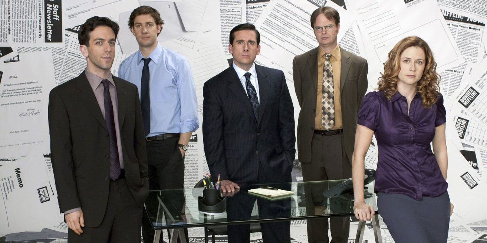

# The Office Build For Fall 2023 :office_worker:
This repo is for homework 2 showing basic CSS layouts, CSS sprites, and a light-box effect.

The TV show "The Office" is an American mockumentary sitcom television series that depicts the everyday work lives of office employees at the Scranton, Pennsylvania, branch of the fictional Dunder Mifflin Paper Company. This show has some off-the-wall humor, which is another reason it’s so popular among Gen Z. There are so many inside jokes that it’s hard to keep count.

## Installation :gear:

No Installation is required.

## Usage :hammer:

Open index.html in the browser of your choice.

## Contributing :bookmark:

1. Fork it!
2. Create your feature branch: `git checkout -b my-new-feature`
3. Commit your changes: `git commit -am 'Add some feature'`
4. Push to the branch: `git push origin my-new-feature`
5. Submit a pull request :D

## History :clock8:
Created on October 27, 2023

Updated on the following days:
November 1, 2023
November 2, 2023
November 9, 2023

**Created on November 1, 2023**
Made for Homework 2

## Credits :writing_hand:

Timothy Bryle Flores

## License :page_facing_up:

MIT License - see included license file.
